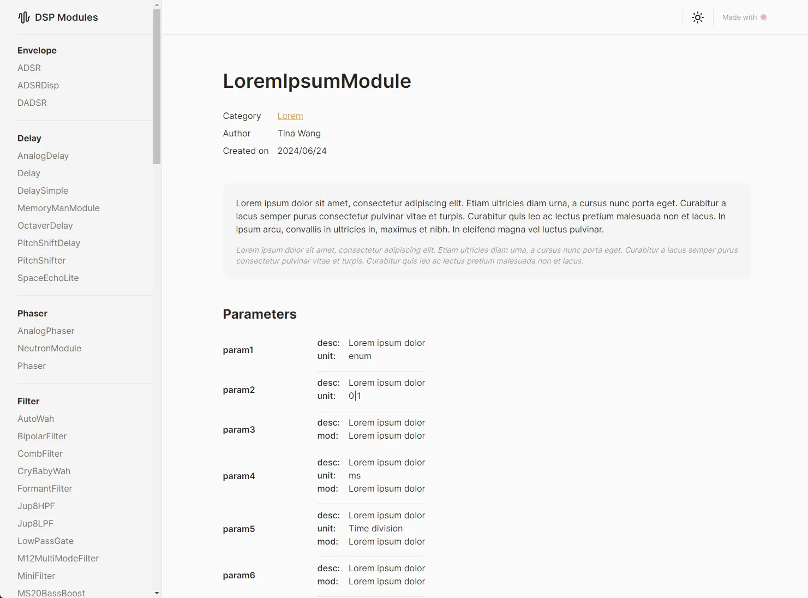
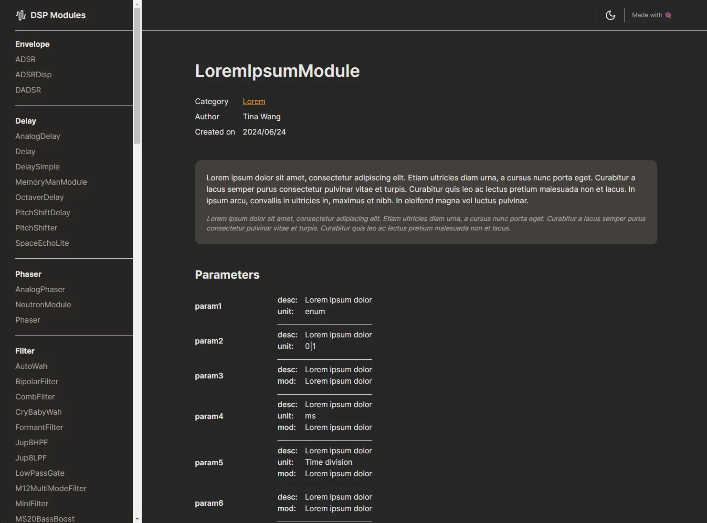

    

    

# What is this
Just a quick repo for a small project. Building a static website using Astro for code documentation. An external script parses the code to generate a json blob with all the necessary information.